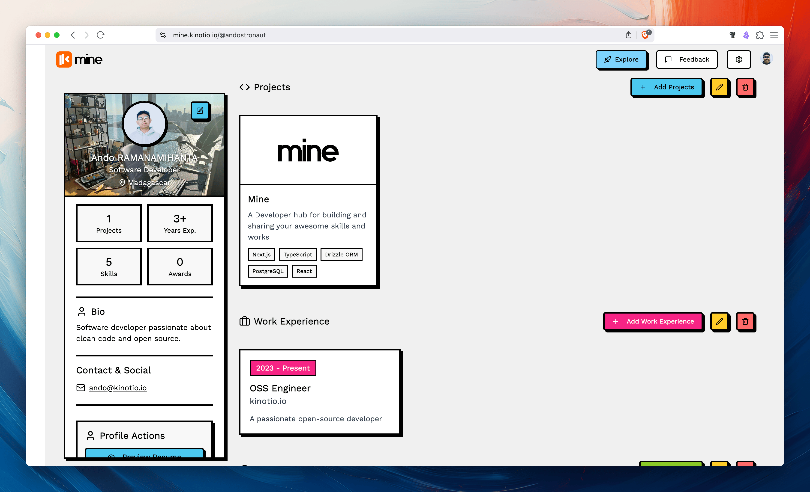

<p align="center">
  
</p>

<p align="center">
  
</p>


Build, Share and Connect

## Setup

### Services

You need to have Docker installed on your machine. you can check [here](https://docs.docker.com/get-docker/) for installation instructions.

Run the docker compose file by executing the following command:

```bash
$ docker-compose up -d
```

### Application

Install dependencies:

```bash
$ pnpm install
```

And then install Infisical CLI [here](https://infisical.com/docs/cli/overview), then run these following commands:

Run database migration by executing the following command:

```bash
$ infisical run --env=dev --watch --recursive -- pnpm run db:migrate
```

And, Run the application by executing the following command:

```bash
$ infisical run --env=dev --watch --recursive -- pnpm dev
```

Or, if you don't have access to our Infisical, you can set all the environment variables from the `.env.example` file to your `.env` file by creating a new `.env` file in the root directory, and then running these following commands:

Run database migration by executing the following command:

```bash
$ pnpm run db:migrate
```

And, Run the application by executing the following command:

```bash
$ pnpm dev
```

## Roadmap

### Resume Features

- [ ] **Templates & Customization**

  - [ ] Multiple resume layout options/themes
  - [ ] Custom color schemes
  - [ ] Font customization options
  - [ ] Custom section ordering

- [ ] **Profile Management**

  - [ ] Profile versioning/history
  - [ ] Multiple profile support for different job types
  - [ ] Backup/restore functionality
  - [ ] Profile completion progress indicator

- [ ] **Social Integration**

  - [ ] Import data from LinkedIn/GitHub
  - [ ] Auto-sync with professional networks
  - [ ] Share profile/resume to social platforms
  - [ ] Social proof integration (GitHub stats, Stack Overflow)

- [ ] **Export Options**

  - [ ] Multiple format support (DOC, TXT, HTML)
  - [x] Custom file naming
  - [ ] Separate section exports
  - [ ] Cover letter generation

- [ ] **Analytics**

  - [ ] Profile view tracking
  - [ ] Resume download statistics
  - [ ] Section engagement metrics
  - [ ] A/B testing for different resume versions

- [ ] **Collaboration**

  - [ ] Feedback/review system
  - [ ] Share drafts with mentors/reviewers
  - [ ] Collaborative editing
  - [ ] Comments and suggestions

- [ ] **Privacy & Security**

  - [ ] Private/public section toggles
  - [ ] Contact information masking
  - [ ] Custom visibility per section
  - [ ] Data encryption options

- [ ] **Optimization**

  - [ ] AI-powered content suggestions
  - [ ] Keyword optimization for ATS
  - [ ] Industry-specific templates
  - [ ] Job description matching

## License

This project is licensed under the MIT License - see the [LICENSE](LICENSE) file for details.
